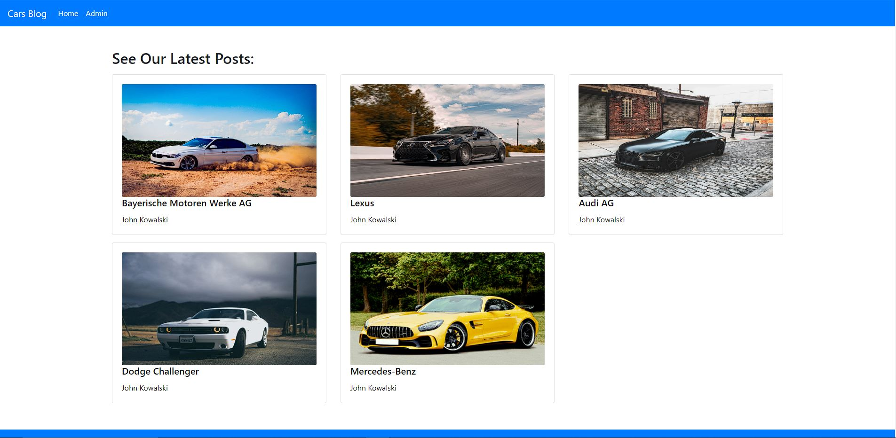
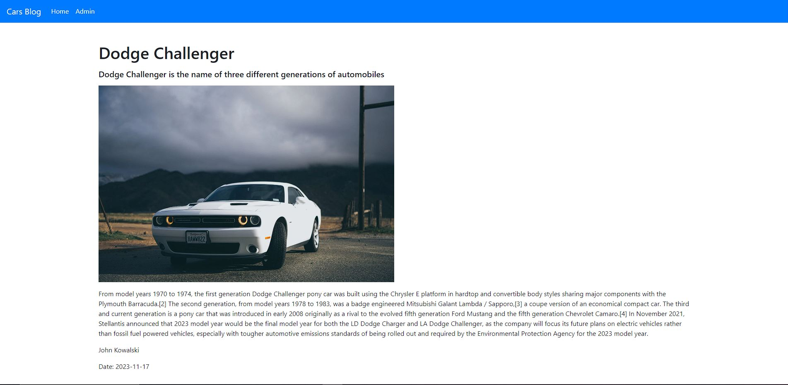
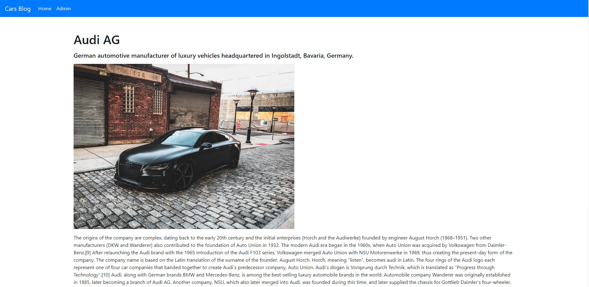
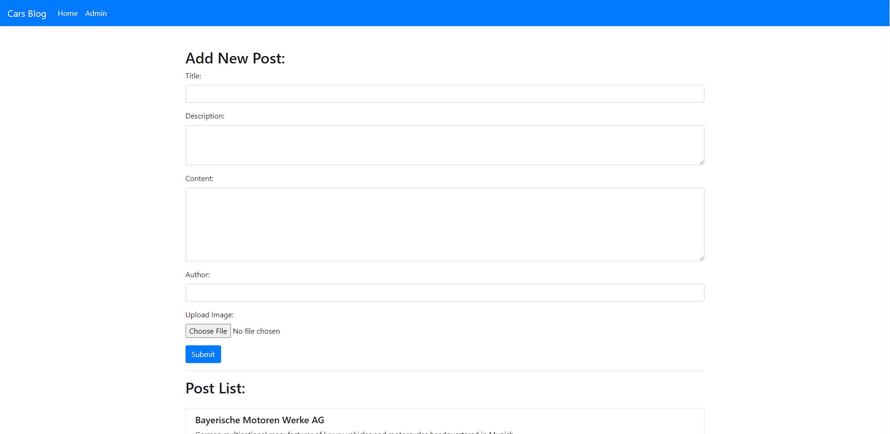
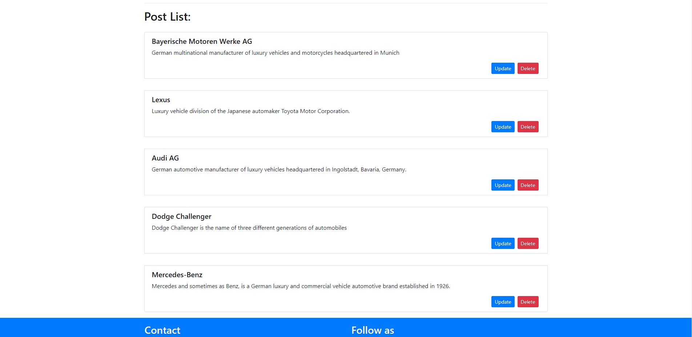
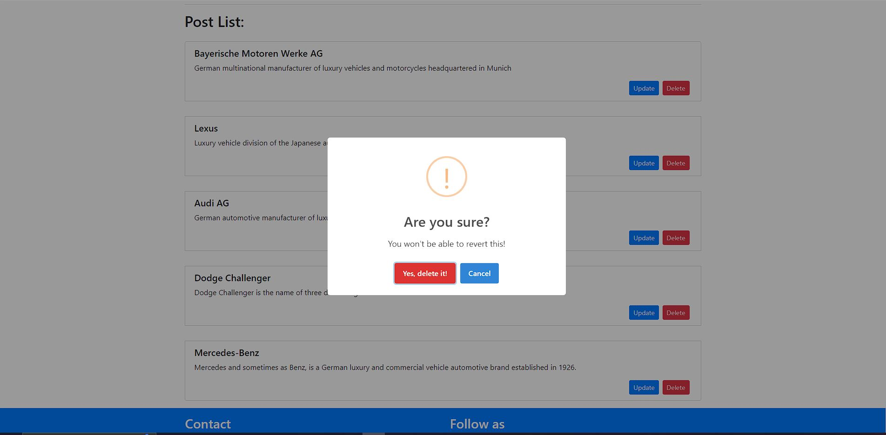
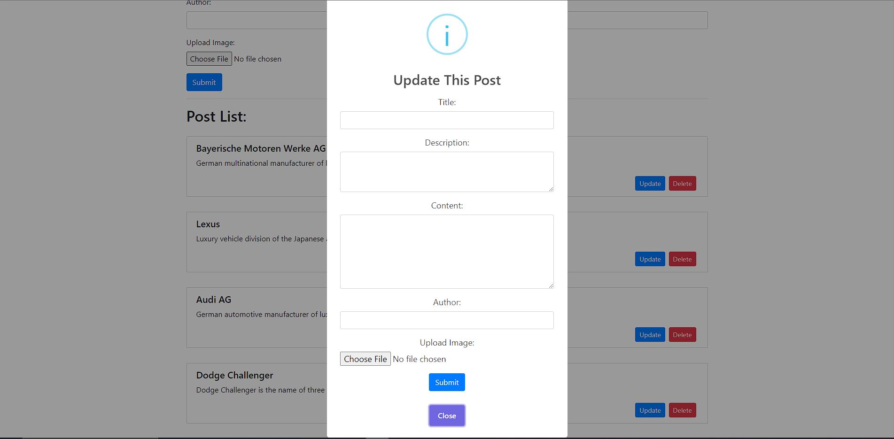

# Simple PHP Blog using XAMPP

A simple blog written in PHP, utilizing XAMPP for a local server environment. The project includes a home page displaying posts, post page and an admin page for adding, editing, and deleting posts.


## Layout

### Home page


### Post page


### Post page


### Admin page


### Admin page list of posts


### Admin page delete modal


### Admin page update modal


## Technologies 

### Frontend

- Webpack for TypeScript Compilation

- SweetAlert2 for Modals

- Axios for API Communication

- Bootstrap for Styling

### Backend

- PHP 8.0.28 with Composer

- Dotenv for Configuration


## Requirements

1. [XAMPP](https://www.apachefriends.org/index.html) - PHP and MySQL server environment.
2. Web browser.
3. npm
4. php
5. composer

## Installation

1. Clone the repository:

    ```bash
    git clone https://github.com/jakubzajkowski/blog-recruitment
    ```

2. Place the project folder called blog in the `htdocs` folder within the XAMPP installation directory.

3. Configure `.env` file to your properties.

4. Install composer packs and autoload `cd \blog` and `composer install`

5. Install node_modules and build `cd \blog\js` > `npm install` > `npm run build`

6. Start the Apache and MySQL servers using the XAMPP Control Panel.

7. If you want to migrate table to database run `php migrate.php`

8. Open the project in your browser by entering `http://localhost/blog` in the address bar.

## Project Structure

- `home`: Home page for displaying posts.
- `admin page`: Administrative page for adding, editing, and deleting posts.
- `api pages`: Api pages for communicate with frontend.


## Contact

For any questions or suggestions, please contact us at [jakudjan123@gmail.com](mailto:jakudjan123@gmail.com.com).

